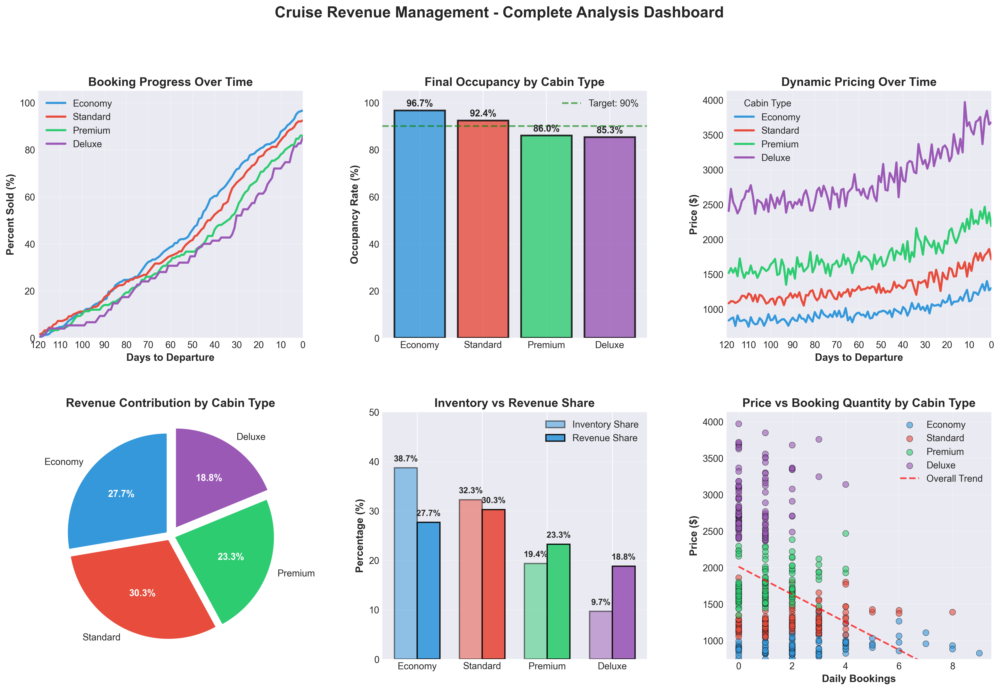

# Cruise Revenue Management: Pricing Strategy Analysis

**Author:** Akio Azevedo  
**Background:** Business Analytics Master's Student

---

## 📋 What This Project Is About

I'm a Business Analytics grad student, and I wanted to apply what I've been learning to a real business problem. I chose **cruise pricing and revenue management** because it's a perfect case study for analytics:

- Ships have fixed capacity (can't add more cabins)
- Empty cabins = lost money (can't sell them after the ship sails)
- Different customers pay different prices

**The main question I'm exploring:** How should a cruise line price their cabins to maximize revenue while keeping the ship full?

---

## 🎯 What I'm Building

### Three Notebooks:

**Notebook 1: Generate Realistic Data** ✅ *Done*
- Created a dataset showing how bookings might happen over 120 days
- Modeled 4 cabin types (Economy to Deluxe)
- Built in realistic pricing (prices go up as sailing gets closer)
- Result: ~95% occupancy, which is pretty good!

**Notebook 2: Predict Bookings** 🚧 *Next*
- Use machine learning to forecast how many people will book each day
- Test different models to see which predicts best
- This would help cruise lines know when to raise/lower prices

**Notebook 3: Find Optimal Prices** 🚧 *Planned*
- Use the forecast model to figure out the best pricing strategy
- Goal: Make the most money while keeping occupancy above 85%

---

## 📊 What I Found So Far

From the data I generated:

| Cabin Type | How Many | Occupancy | Revenue Share | Avg Price |
|------------|----------|-----------|---------------|-----------|
| Economy    | 300      | 96.7%     | 26.8%         | $962      |
| Standard   | 250      | 92.4%     | 30.2%         | $1,314    |
| Premium    | 150      | 86.0%     | 23.5%         | $1,775    |
| Deluxe     | 50       | 85.3%     | 19.5%         | $2,870    |

**Key insight:** The expensive cabins (Premium + Deluxe) are only 27% of the ship but bring in 43% of revenue. This shows why premium pricing matters.

---

## 📊 Visualizations



I built a dashboard showing:
- How bookings build up over time
- Which cabin types sell out first
- How prices change as the sailing date gets closer
- Revenue breakdown by cabin type
- The relationship between price and bookings

---

## 🛠️ How to Run This

### What You Need
- Python 3.10 or newer
- Jupyter Notebook

### Setup Steps

1. **Clone this repo**
```bash
git clone https://github.com/akioazevedo/cruise-revenue-management.git
cd cruise-revenue-management
```

2. **Set up Python environment**
```bash
python3 -m venv venv
source venv/bin/activate  # On Windows: venv\\Scripts\\activate
```

3. **Install packages**
```bash
pip install pandas numpy matplotlib seaborn scikit-learn jupyter
```

4. **Start Jupyter**
```bash
jupyter notebook
```

5. **Open** `notebooks/01_data_generation.ipynb` and run it

---

## 📁 Project Structure
```
cruise-revenue-management/
├── data/
│   └── processed/
│       └── cruise_bookings.csv      # The dataset I generated
├── figures/
│   └── dashboard_complete.png        # Visualizations
├── notebooks/
│   ├── 01_data_generation.ipynb      # ✅ Complete
│   ├── 02_demand_forecasting.ipynb   # 🚧 Coming soon
│   └── 03_price_optimization.ipynb   # 🚧 Planned
└── README.md
```

---

## 🧠 What I'm Learning

**From my coursework:**
- Using Python for data analysis (pandas, numpy)
- Building statistical models (price elasticity, demand curves)
- Creating clear visualizations
- Thinking about business problems analytically

**Skills I'm applying:**
- Data generation and validation
- Exploratory data analysis
- Statistical modeling
- Python programming
- Data visualization

**Business thinking:**
- Understanding pricing strategy
- Balancing revenue vs occupancy
- Premium vs budget customer segments

---

## 💡 Why This Matters

Revenue management is huge in travel, hospitality, and entertainment. Airlines, hotels, and cruise lines all deal with the same challenge: **fixed inventory that expires**. Learning how to optimize pricing in these situations is valuable for roles in:
- Pricing strategy
- Revenue management
- Business analytics
- Data science

---

## 🚀 What's Next

For Notebook 2, I'll:
- Split the data into training and testing sets
- Build ML models (Linear Regression, Random Forest, XGBoost)
- Compare which model predicts bookings best
- Use those predictions for pricing optimization in Notebook 3

---

## 📫 Get in Touch

**Akio Azevedo**

- GitHub: [@akioazevedo](https://github.com/akioazevedo)
- LinkedIn: [Your LinkedIn]
- Email: [Your Email]

I'm actively looking for **Data Analyst** and **Business Analyst** opportunities where I can apply these skills!

---

## 📝 Note

This is a portfolio project for my grad program. The data is synthetic (I created it), but it's designed to mimic real cruise booking patterns based on industry research.
