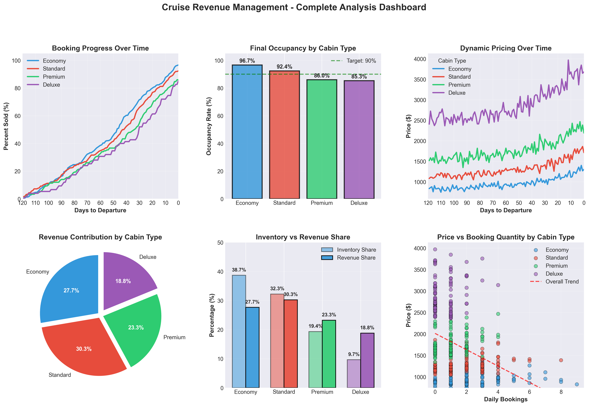

# Cruise Revenue Management: Pricing Strategy Analysis

**Author:** Akio Azevedo
**Background:** Business Analytics Master's Student

---

## What This Project Is About

I'm a Business Analytics grad student, and I wanted to apply what I've been learning to a real business problem. I chose **cruise pricing and revenue management** because it's a perfect case study for analytics:

- Ships have fixed capacity (can't add more cabins)
- Empty cabins = lost money (can't sell them after the ship sails)
- Different customers pay different prices

**The main question I'm exploring:** How should a cruise line price their cabins to maximize revenue while keeping the ship full?

---

## Project Notebooks

### Notebook 1: Data Generation (`01_data_generation.ipynb`) -- Complete
- Created a dataset simulating bookings over a 90-day window before departure
- Modeled 3 cabin types (Interior, Outside, Balcony)
- Built in realistic pricing dynamics with base prices, price floors/caps, and demand indexing
- Simulated daily bookings using Poisson distribution and price elasticity effects
- Generated a comprehensive dashboard and visualizations

### Notebook 2: Synthetic Data Pipeline (`02_synthetic_data_generation.ipynb`) -- Complete
- Companion to Notebook 1 for detailed synthetic data generation
- Visualizations of price evolution and inventory sell-through
- Revenue share analysis by cabin type
- Exported enhanced booking dataset

### Notebook 3: Demand Forecasting (`03_demand_forecasting.ipynb`) -- Complete
- Implemented logistic S-curve booking model parameterized per cabin type
- Forecast parameters tuned for each cabin (different booking curve shapes)
- Generated expected vs actual sell-through comparisons
- Produced cumulative revenue forecasts and price-vs-bookings analysis
- Output: clean forecasting dataset with actual and predicted values

### Notebook 4: Price Optimization (`04_Optimization.ipynb`) -- Complete
- Built a price optimization engine using demand response functions and price elasticity
  - Interior elasticity: -1.2 (most price-sensitive)
  - Outside elasticity: -1.0
  - Balcony elasticity: -0.8 (least price-sensitive)
- Tests 7 price multipliers (0.85x to 1.15x of current price)
- Optimizes for revenue while respecting inventory constraints
- Generates a decision table comparing expected vs optimized pricing strategies
- Shows daily and cumulative revenue uplift from optimization

---

## Key Findings

**Cabin type characteristics from the data:**

| Cabin Type | Base Price | Elasticity | Booking Curve |
|------------|-----------|------------|---------------|
| Interior   | $250      | -1.2       | Steep (books fast) |
| Outside    | $350      | -1.0       | Moderate |
| Balcony    | $500      | -0.8       | Gentle (books gradually) |

**Optimization insights:**
- Most revenue uplift opportunities occur in the mid-booking window (30-60 days before departure)
- Balcony cabins show the highest optimization potential from price increases
- Interior cabins show more conservative optimization with downward price pressure to maintain volume
- Final sell-through rates reach 82-100% by cabin type

---

## Visualizations



The project includes visualizations covering:
- Price evolution over the booking window by cabin type
- Revenue contribution breakdown
- Occupancy and inventory sell-through analysis
- Correlation matrix across pricing factors
- Forecast vs actual sell-through curves
- Expected vs optimized pricing comparisons

---

## How to Run This

### What You Need
- Python 3.10 or newer
- Jupyter Notebook

### Setup Steps

1. **Clone this repo**
```bash
git clone https://github.com/akioazevedo/cruise-revenue-management.git
cd cruise-revenue-management
```

2. **Set up Python environment**
```bash
python3 -m venv venv
source venv/bin/activate  # On Windows: venv\Scripts\activate
```

3. **Install packages**
```bash
pip install -r requirements.txt
```

4. **Start Jupyter**
```bash
jupyter notebook
```

5. **Run the notebooks in order** starting with `notebooks/01_data_generation.ipynb`

---

## Project Structure
```
cruise-revenue-management/
├── data/processed/
│   ├── cruise_bookings.csv
│   ├── cruise_pricing_with_bookings.csv
│   ├── cruise_pricing_with_forecast_clean.csv
│   └── cruise_pricing_decision_table_expected_vs_optimized.csv
├── figures/
│   ├── 01_price_evolution.png
│   ├── 02_revenue_contribution.png
│   ├── 03_occupancy_analysis.png
│   ├── 04_correlation_matrix.png
│   └── dashboard_complete.png
├── notebooks/
│   ├── 01_data_generation.ipynb
│   ├── 02_synthetic_data_generation.ipynb
│   ├── 03_demand_forecasting.ipynb
│   └── 04_Optimization.ipynb
├── requirements.txt
└── README.md
```

---

## Skills Applied

**Analytics & Modeling:**
- Synthetic data generation with realistic booking dynamics
- Demand forecasting using logistic curve models
- Price optimization with elasticity-based demand response
- Revenue management decision support

**Technical:**
- Python (pandas, numpy, matplotlib)
- Statistical modeling (price elasticity, demand curves, Poisson processes)
- Data visualization and dashboard creation
- Jupyter notebooks for reproducible analysis

**Business Thinking:**
- Understanding pricing strategy and revenue management tradeoffs
- Balancing revenue maximization vs occupancy targets
- Segment-level pricing (different strategies for different cabin types)

---

## Why This Matters

Revenue management is huge in travel, hospitality, and entertainment. Airlines, hotels, and cruise lines all deal with the same challenge: **fixed inventory that expires**. Learning how to optimize pricing in these situations is valuable for roles in:
- Pricing strategy
- Revenue management
- Business analytics
- Data science

---

## Note

This is a portfolio project for my grad program. The data is synthetic (I created it), but it's designed to mimic real cruise booking patterns based on industry research.
